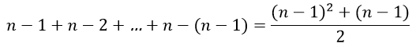
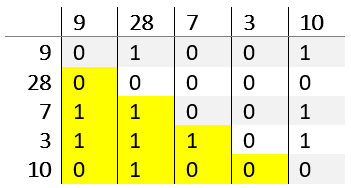
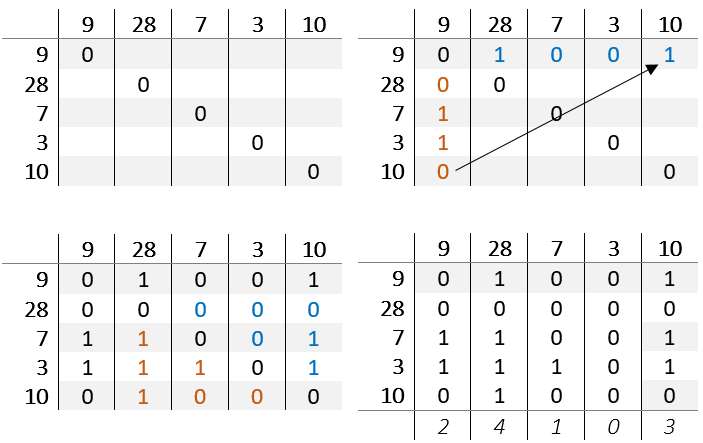

 # TableSort
A sorting algorithm which describes determines the correct position by comparing the values of a imaginary table

## Describtion

Compare the value of each cell with each other:
If a < b then the position of of a is incremented, else the position b is incremented.

If all comparisons are completed, sum the entries of each column.
The new position is the sum of a column.

## Number of comparisons

table[x,y] = |table[y,x] - 1|

So you only have to check

cells, which equals the number of comparisons.

## Example

