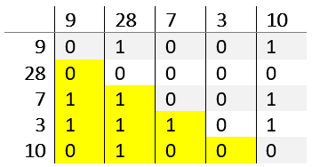
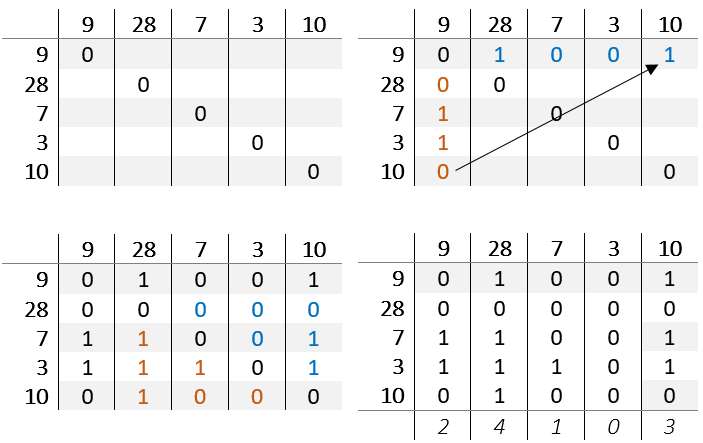

# TableSort
A sorting algorithm which describes determines the correct position by comparing the values of a imaginary table

##Describtion

Compare the value of each cell with each other:
If a < b then the position of of a is incremented, else the position b is incremented.

If all comparisons are completed, sum the entries of each column.
The new position is the sum of a column.

##Number of comparisons
* table[x,y] = |table[y,x] - 1|
* So you only have to check (Length - 1 + Length - 2 + Length - n) = ((Length - 1)^2 + (Length - 1)) / 2 cells 
* The number of comparisons equals the Triangular number with n = length - 1

##Example
 
